# Database System for CSC Form 212 

Disclaimer: This is a prototype system and only meant for educational purposes as part of the requirements in COMP 20093: Information Management at the Polytechnic University of the Philippines - Manila.

## Overview
The project focuses on designing a database system based on the CSC Form 212, also known as the Personal Data Sheet (PDS). This form is issued by the Civil Service Commission (CSC), the government agency responsible for managing the civil service and overseeing employment in the public sector in the Philippines. This form is used to collect and organize essential personal, educational, and employment information of individuals applying for or working in government positions. 

## Architecture

This project uses a 3-tier architecture with CI/CD pipeline.

### Information Architecture

```mermaid
flowchart LR
    subgraph Client [Frontend Tier]
        User([User Browser])
        Vercel[Vercel / HTML / JS]
    end

    subgraph Server [Backend Tier]
        Render[Render Web / Node.js / Express]
    end

    subgraph Database [Data Tier]
        CleverCloud[(Clever Cloud / MySQL DB)]
    end

    User -- "Fills Form" --> Vercel
    Vercel -- "POST Request / JSON" --> Render
    Render -- "SQL INSERT Queries" --> CleverCloud
    CleverCloud -- "Success/Error" --> Render
    Render -- "HTTP Response" --> Vercel
    Vercel -- "Displays Message" --> User

    classDef client fill:#333333,stroke:#FFFF00,stroke-width:2px;
    classDef server fill:#333333,stroke:#0288d1,stroke-width:2px;
    classDef db fill:#333333,stroke:#8e24aa,stroke-width:2px;
    
    class Vercel client;
    class Render server;
    class CleverCloud db;
```

(Graph from Mermaid Chart for documentation)

1. **Frontend (Vercel):** The front (`index.html`). Receives user input and uses the JavaScript `fetch` API to send data. Hosted on Vercel.
2. **Backend (Render):** The backend (`server.js`). Receives HTTP POST requests on `/api/submit`. Parses JSON, structures SQL queries, and communicates with the DB using credentials.
3. **Database (Clever Cloud/MySQL):** The storage layer. Receives SQL instructions and securely stores the applicant data in the database.

## Contributors
|Name |
|------|
|China De Oro|
|Christian Ignacio| 
|Cielo Mae Valdez|
|Eugene Welan|
